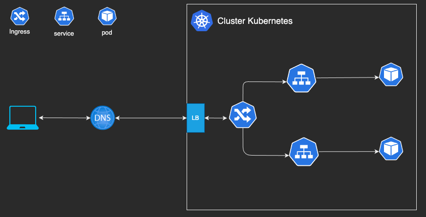

# kubernetes_dns_interno
Demostrando como funciona o dns interno dentro de um cluster kubernetes


## O caminho de uma requisição



**INGRESS**: Faz o roteamento das requisicoes, o ingress é inteligente para saber qual service é responsavel por receber aquela requisição. No ingress é configurado qual dns ele é responsavel e qual service pode receber as requisicoes vinda daquele dns. 

Temos dois tipos de ingress, um ingress do tipo _path_ e o outro do tipo _host_, o da imagem abaixo é do tipo _host_.

```
apiVersion: networking.k8s.io/v1
kind: Ingress
metadata:
  labels:
    app: cka-ingress
  name: cka-ingress
  namespace: cka
spec:
  rules:
  - host: cka-ingres.dominio.com.br
    http:
      paths:
      - backend:
          service:
            name: cka-ingress
            port:
              number: 80
        path: /
        pathType: ImplementationSpecific
status:
  loadBalancer: {}
```


**SERVICE**: O service é responsavel por pega a requisicoes e enviar para o pod. Ele sabe qual pod enviar atraves da label. Para os pods o service é a "porta" de entrada e saida de requisicoes por isso é importante que a configuracao do service esteja correta.

Existe tres tipos de services, o da imagem abaixo é o do tipo ClusterIP. 
```
apiVersion: v1
kind: Service
metadata:
  creationTimestamp: null
  labels:
    app: nginx
  name: nginx
  namespace: cka
spec:
  ports:
  - port: 80
    protocol: TCP
    targetPort: 80
  selector:
    app: nginx
  type: ClusterIP
status:
  loadBalancer: {}
```

No paramentro **_port_** e **_target-port_** é configurado as portas dos container é do service, estilo NAT.
**_port_**: porta que o service esta escutando e respondendo
**_target-port_**: porta do container que o service estara enviando requisicoes, essa porta precisa ser a mesma porta da aplicação.


Além de identificar o pod pela label o service cria um outro objeto chamado EndPoints que faz o mapeamento dos IPs dos pods que ele poderam enviar as requisicoes.
```
NAME           ENDPOINTS                         AGE
nginx        172.xx.xx.x:80,172.xx.xx.x:80       45s
```


**POD**: é o menor objeto de uma estrutura k8bernetes e onde fica o(s) container(s) com a aplicacao.


## Comunicação Interna

Como dito anteriormente o service é a porta de entrada para requisicoes chegar nos pods. Vamos testa algumas comunicacoes interna do cluster que servira como troubleshooting.

### Entre pods da mesma namespace
```
kubectl exec -it -n $name_ns $name_pod -- curl $name_pod_ip.cka.pod 
```

### Entre Pods e services da mesma namespace
```
kubectl exec -it -n cka nginx-1-7788ff6855-lrh4h -- curl nginx-1
```

###  Entre pods de namespaces diferentes

```
kubectl exec -it -n cka nginx-1-7788ff6855-lrh4h -- curl 172-30-xxx-xx.cka-duo.pod.cluster.local
```

###  Entre pods e services de namespaces diferentes

```
kubectl exec -it -n cka nginx-1-7788ff6855-lrh4h -- curl nginx-1-duo.cka-duo.svc.cluster.local 
```
